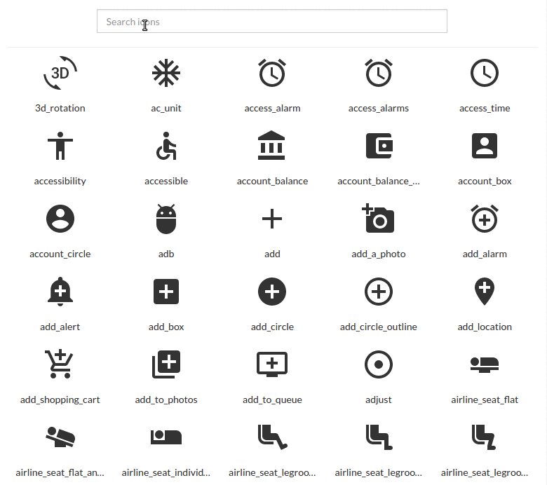

[](https://circleci.com/gh/OpusCapita/react-svg)

[](https://npmjs.org/package/@opuscapita/react-svg)


# React SVG

## Synopsis

[Demo and documentation](https://opuscapita.github.io/react-svg)
=======


[Demo and documentation](https://opuscapita.github.io/react-svg/)

> Powered by [OpusCapita Showroom](https://github.com/OpusCapita/react-showroom-client)

## Usage

#### Install package:

`yarn add @opuscapita/react-svg`

#### Import component

```
import { SVG } from '@opuscapita/react-svg
import SVGIcon from '@opuscapita/react-svg/lib/SVGIcon
...
```

## Contributors

| [](https://github.com/asergeev-sc) | [**Alexey Sergeev**](https://github.com/asergeev-sc)     |
| :---: | :---: |
| [](https://github.com/asergeev-sc) | [**Kirill Volkovich**](https://github.com/kvolkovich-sc) |

## License

Licensed under the Apache License, Version 2.0. See [LICENSE](./LICENSE) for the full license text.
